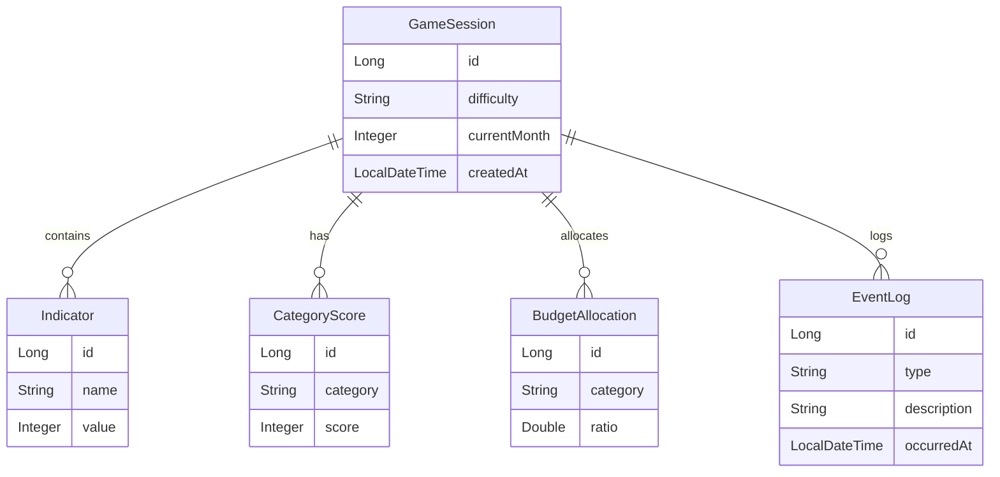

# ERD Draft

```mermaid
erDiagram
    GameSession {
        Long id
        String difficulty
        Integer currentMonth
        LocalDateTime createdAt
    }
    Indicator {
        Long id
        String name
        Integer value
    }
    CategoryScore {
        Long id
        String category
        Integer score
    }
    BudgetAllocation {
        Long id
        String category
        Double ratio
    }
    EventLog {
        Long id
        String type
        String description
        LocalDateTime occurredAt
    }
    GameSession ||--o{ Indicator : contains
    GameSession ||--o{ CategoryScore : has
    GameSession ||--o{ BudgetAllocation : allocates
    GameSession ||--o{ EventLog : logs
```
